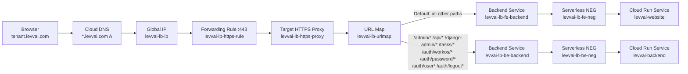

# Load Balancer (Brief)

## Diagram



## What routes where

- Backend (`levvai-backend`):
  - `/admin/*`
  - `/api/*`
  - `/django-admin/*`
  - `/tasks/*`
  - `/auth/workos/*`
  - `/auth/password/*`
  - `/auth/user*`
  - `/auth/logout*`
- Frontend (`levvai-website`):
  - everything else (default route)

## Key resources

- URL map: `levvai-lb-urlmap`
- HTTPS proxy: `levvai-lb-https-proxy`
- Forwarding rule: `levvai-lb-https-rule`
- Global IP: `levvai-lb-ip`
- Frontend NEG/backend:
  - `levvai-lb-fe-neg` -> `levvai-lb-fe-backend` -> `levvai-website`
- Backend NEG/backend:
  - `levvai-lb-be-neg` -> `levvai-lb-be-backend` -> `levvai-backend`

## Minimal checks

```bash
# URL map + path rules
gcloud compute url-maps describe levvai-lb-urlmap --format='yaml(pathMatchers,hostRules)'

# NEG targets
gcloud compute network-endpoint-groups describe levvai-lb-fe-neg --region us-east1 --format='value(cloudRun.service)'
gcloud compute network-endpoint-groups describe levvai-lb-be-neg --region us-east1 --format='value(cloudRun.service)'

# Sanity requests
curl -i https://test.levvai.com/
curl -i https://test.levvai.com/auth/user
curl -i -X POST https://test.levvai.com/auth/logout
```

## Notes

- Wildcard DNS should point `*.levvai.com` to `levvai-lb-ip`.
- If tenant host returns Google/Cloud Run 404 for frontend routes, verify URL map default route and frontend host rewrite.
