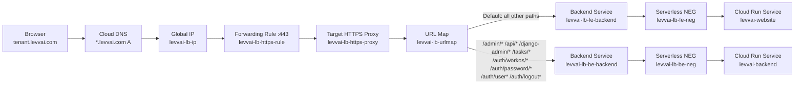

# Load Balancer (Brief)

## Diagram


```mermaid
flowchart LR
    U[Browser<br/>tenant.levvai.com] --> DNS[Cloud DNS<br/>*.levvai.com A]
    DNS --> IP[Global IP<br/>levvai-lb-ip]
    IP --> FR[Forwarding Rule :443<br/>levvai-lb-https-rule]
    FR --> PXY[Target HTTPS Proxy<br/>levvai-lb-https-proxy]
    PXY --> MAP[URL Map<br/>levvai-lb-urlmap]

    MAP -->|Default: all other paths| FEBE[Backend Service<br/>levvai-lb-fe-backend]
    MAP -->|/admin/* /api/* /django-admin/* /tasks/*<br/>/auth/workos/* /auth/password/*<br/>/auth/user* /auth/logout*| BEBE[Backend Service<br/>levvai-lb-be-backend]

    FEBE --> FENEG[Serverless NEG<br/>levvai-lb-fe-neg]
    BEBE --> BENEG[Serverless NEG<br/>levvai-lb-be-neg]

    FENEG --> FE[Cloud Run Service<br/>levvai-website]
    BENEG --> BE[Cloud Run Service<br/>levvai-backend]
```

## What routes where

- Backend (`levvai-backend`):
  - `/admin/*`
  - `/api/*`
  - `/django-admin/*`
  - `/tasks/*`
  - `/auth/workos/*`
  - `/auth/password/*`
  - `/auth/user*`
  - `/auth/logout*`
- Frontend (`levvai-website`):
  - everything else (default route)

## Edit path routing (FE vs BE)

1. Inspect current rules:

```bash
gcloud compute url-maps describe levvai-lb-urlmap --global --format='yaml(pathMatchers,hostRules)'
```

2. Edit the URL map:

```bash
gcloud compute url-maps edit levvai-lb-urlmap --global
```

3. In `pathMatchers` with `name: backend`, edit `pathRules` to route paths to the correct backend service.
Most specific paths should be explicit (for example, `/admin/users*` before `/admin/*`).

```yaml
pathMatchers:
- name: backend
  defaultService: https://www.googleapis.com/compute/v1/projects/levvai/global/backendServices/levvai-lb-fe-backend
  pathRules:
  - paths:
    - /admin/users
    - /admin/users/*
    service: https://www.googleapis.com/compute/v1/projects/levvai/global/backendServices/levvai-lb-fe-backend
  - paths:
    - /admin/*
    - /api/*
    - /auth/workos/*
    - /auth/password/*
    - /django-admin/*
    - /tasks/*
    - /auth/logout
    - /auth/logout/*
    service: https://www.googleapis.com/compute/v1/projects/levvai/global/backendServices/levvai-lb-be-backend
```

4. Validate routing decisions before and after rollout:

```bash
gcloud compute url-maps test levvai-lb-urlmap --global --host=<your-domain> --path=/admin/users
gcloud compute url-maps test levvai-lb-urlmap --global --host=<your-domain> --path=/admin/settings
```

5. Re-check live config:

```bash
gcloud compute url-maps describe levvai-lb-urlmap --global --format='yaml(pathMatchers)'
```

Notes:
- Path matching uses longest/most specific match, so `/admin/users*` wins over `/admin/*`.
- `defaultRouteAction.urlRewrite` only applies to default routing; if a non-default path also needs `hostRewrite`, use `routeRules` for that path with `urlRewrite`.

## Key resources

- URL map: `levvai-lb-urlmap`
- HTTPS proxy: `levvai-lb-https-proxy`
- Forwarding rule: `levvai-lb-https-rule`
- Global IP: `levvai-lb-ip`
- Frontend NEG/backend:
  - `levvai-lb-fe-neg` -> `levvai-lb-fe-backend` -> `levvai-website`
- Backend NEG/backend:
  - `levvai-lb-be-neg` -> `levvai-lb-be-backend` -> `levvai-backend`

## Minimal checks

```bash
# URL map + path rules
gcloud compute url-maps describe levvai-lb-urlmap --format='yaml(pathMatchers,hostRules)'

# NEG targets
gcloud compute network-endpoint-groups describe levvai-lb-fe-neg --region us-east1 --format='value(cloudRun.service)'
gcloud compute network-endpoint-groups describe levvai-lb-be-neg --region us-east1 --format='value(cloudRun.service)'

# Sanity requests
curl -i https://test.levvai.com/
curl -i https://test.levvai.com/auth/user
curl -i -X POST https://test.levvai.com/auth/logout
```

## Notes

- Wildcard DNS should point `*.levvai.com` to `levvai-lb-ip`.
- If tenant host returns Google/Cloud Run 404 for frontend routes, verify URL map default route and frontend host rewrite.
